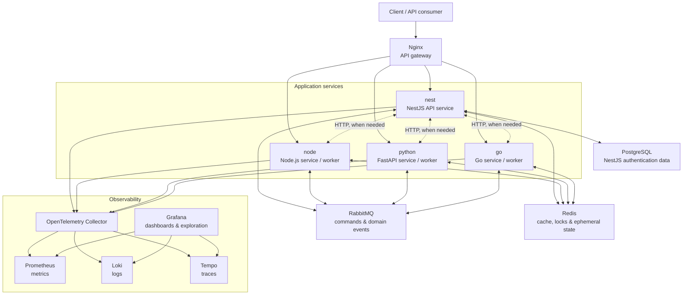

# Microservice Template

A local-first, polyglot microservice template for building independently deployable services with a consistent approach to messaging, caching, health checks, and observability.

The template starts with four example services:

| Service  | Runtime              | Primary role                                      | Default port |
| -------- | -------------------- | ------------------------------------------------- | ------------ |
| `nest`   | Node.js + NestJS     | API-oriented service and reference implementation | `3000`       |
| `node`   | Node.js + TypeScript | Lightweight workers or HTTP services              | `3001`       |
| `python` | Python + FastAPI     | Data, automation, or ML-facing services           | `8000`       |
| `go`     | Go                   | High-throughput APIs, workers, or integrations    | `8080`       |

## Architecture

Each service owns its business logic and communicates synchronously through HTTP only when an immediate response is necessary. Asynchronous, cross-service work is published as domain events through RabbitMQ. Redis is shared infrastructure for cache, short-lived state, rate limiting, and distributed coordination; it must not become the source of truth for business data.



## Tech stack

### Application services

- **NestJS 11 / Node.js / TypeScript** - reference API service, validation, modular architecture, and TypeORM support already present in `nest/`.
- **Node.js / TypeScript** - simple event consumers, integrations, and small services without the full NestJS framework.
- **Python / FastAPI** - typed HTTP APIs and workloads that benefit from the Python ecosystem.
- **Go** - efficient, statically compiled services for performance-sensitive or concurrent workloads.

### Shared infrastructure

- **Docker Compose** - a single local development entry point for services and dependencies.
- **Nginx** - a single HTTP entry point that routes client requests to application services.
- **RabbitMQ** - durable asynchronous messaging. Each service consumes its own queue; events are routed through topic exchanges.
- **Redis** - caching, idempotency keys, rate limits, locks, and other short-lived distributed state.

### Observability

- **OpenTelemetry** - common instrumentation standard across all four runtimes. Services export traces, metrics, and structured logs with a shared correlation ID.
- **OpenTelemetry Collector** - receives telemetry and decouples service configuration from backend configuration.
- **Prometheus** - metrics storage and scraping.
- **Loki** - centralized structured log storage.
- **Tempo** - distributed trace storage.
- **Grafana** - dashboards and correlated investigation across metrics, logs, and traces.

## Repository layout

```text
.
|-- docker-compose.yml              # Local applications and core infrastructure stack
|-- nginx/                          # Nginx API gateway configuration
|-- react/                          # React showcase application, built to dist/
|-- nest/                           # Existing NestJS reference service
|-- node/                           # Node.js + TypeScript service
|-- python/                         # Python + FastAPI service
|-- go/                             # Go service
|-- observability/                  # Collector, Prometheus, Loki, Tempo, and Grafana configuration
`-- docs/                           # Architecture decisions and service contracts
```

The `observability/` and `docs/` directories will be added as the Compose stack and service contracts are implemented.

## Service conventions

Every service should provide the following from the beginning:

- `GET /health/live` for process liveness and `GET /health/ready` for dependency readiness.
- A `/metrics` endpoint or OpenTelemetry metrics export, depending on the runtime integration.
- Structured JSON logs with `service.name`, `trace_id`, `span_id`, environment, and request/event correlation IDs.
- OpenTelemetry tracing for inbound HTTP requests, outbound HTTP calls, and RabbitMQ publish/consume operations.
- Environment-based configuration with a checked-in `.env.example`, never committed secrets.
- Idempotent message consumers, explicit retry policies, and dead-letter queues for failed messages.

## Messaging conventions

RabbitMQ messages will use a versioned event envelope so services can evolve independently:

```json
{
  "id": "uuid",
  "type": "orders.order-created",
  "version": 1,
  "occurredAt": "2026-07-24T12:00:00Z",
  "correlationId": "uuid",
  "producer": "nest",
  "data": {}
}
```

- Exchange names describe a bounded context, for example `orders.events`.
- Routing keys describe event types, for example `orders.order-created`.
- A consumer owns its queue; publishers never publish directly to another service's queue.
- Contract changes are backward compatible or introduced as a new event version.

## Docker Compose topology

The current Compose stack includes the following named services:

| Compose service                | Purpose                         | Host access        |
| ------------------------------ | ------------------------------- | ------------------ |
| `nginx`                        | API gateway and reverse proxy   | `8080`             |
| `nest`, `node`, `python`, `go` | Application services            | Internal via Nginx |
| `rabbitmq`                     | Event broker with management UI | `5672`, `15672`    |
| `redis`                        | Cache and ephemeral state       | `6379`             |
| `postgres`                     | NestJS authentication data      | `5432`             |

All containers currently join the default Compose network. Persistent named volumes are used for NestJS dependencies, PostgreSQL, RabbitMQ, and Redis data. Application source is mounted in development for fast feedback.

The planned observability topology is:

| Compose service  | Purpose                         | Host access         |
| ---------------- | ------------------------------- | ------------------- |
| `otel-collector` | Telemetry ingestion and routing | `4317`, `4318`      |
| `prometheus`     | Metrics                         | `9090`              |
| `loki`           | Logs                            | Internal by default |
| `tempo`          | Traces                          | Internal by default |
| `grafana`        | Observability UI                | `3002`              |

## Planned local workflow

Start the full local application stack with:

```bash
docker compose up --build
```

Build the React showcase before starting Nginx, or whenever its source changes:

```bash
cd react
yarn build
```

Useful local endpoints will be:

| Tool                | URL                               |
| ------------------- | --------------------------------- |
| Nginx health        | http://localhost:8080/health      |
| React showcase      | http://localhost:8080/            |
| NestJS service      | http://localhost:8080/api/nest/   |
| Node.js service     | http://localhost:8080/api/node/   |
| Python service      | http://localhost:8080/api/python/ |
| Go service          | http://localhost:8080/api/go/     |
| RabbitMQ Management | http://localhost:15672            |
| PostgreSQL          | localhost:5432                    |

## Implementation order

1. Define Dockerfiles and minimal health endpoints for all four services.
2. Build the Docker Compose development stack with RabbitMQ and Redis.
3. Add a shared event envelope, sample publisher/consumer flow, retries, and dead-letter queues.
4. Add OpenTelemetry instrumentation and the Collector, Prometheus, Loki, Tempo, and Grafana configuration.
5. Add CI checks, contract tests, and production deployment guidance.

## Principles

- Prefer asynchronous events for cross-service workflows.
- Keep services independently buildable, testable, and deployable.
- Treat observability as a service requirement, not an afterthought.
- Start with a small, explicit platform and add infrastructure only when a concrete use case needs it.
